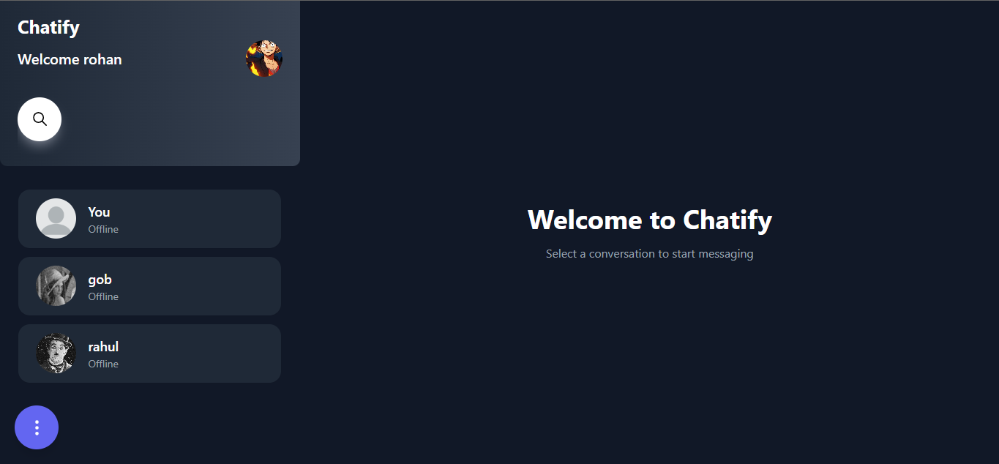

# Chatify - Real-Time Chat Application

Chatify is a modern real-time chat application built with the MERN stack (MongoDB, Express.js, React.js, Node.js) and Socket.IO for real-time communication.



## Features

- 🔐 User authentication (signup/login)
- 👤 User profiles with customizable avatars
- 💬 Real-time messaging
- 🌓 Dark/Light mode
- 📎 File sharing support
- 🖼️ Image sharing
- 😊 Emoji support
- 🔍 User search functionality
- 📱 Responsive design
- 🔴 Online/Offline status
- 🔔 Unread message counters

## Tech Stack

### Frontend
- React.js
- Redux Toolkit for state management
- TailwindCSS for styling
- Socket.IO Client
- Emoji Picker React
- Axios for API requests

### Backend
- Node.js
- Express.js
- MongoDB with Mongoose
- Socket.IO
- JWT for authentication
- Cloudinary for file storage
- Bcrypt for password hashing

## Getting Started

### Prerequisites
- Node.js (v14 or higher)
- MongoDB database
- Cloudinary account

### Installation

1. Clone the repository:
```bash
git clone https://github.com/Anshul-18/chatify.git
cd chatify
```

2. Install dependencies for backend:
```bash
cd backend
npm install
```

3. Install dependencies for frontend:
```bash
cd ../frontend
npm install
```

4. Create a `.env` file in the backend directory with the following variables:
```env
PORT=8000
MONGODB_URL=your_mongodb_url
JWT_SECRET=your_jwt_secret
CLOUD_NAME=your_cloudinary_cloud_name
API_KEY=your_cloudinary_api_key
API_SECRET=your_cloudinary_api_secret
```

5. Start the backend server:
```bash
cd backend
npm run dev
```

6. Start the frontend development server:
```bash
cd frontend
npm run dev
```

The application should now be running on `http://localhost:5173`

## API Endpoints

### Authentication
- `POST /api/auth/signup` - Register a new user
- `POST /api/auth/login` - Login user
- `GET /api/auth/logout` - Logout user

### Users
- `GET /api/user/current` - Get current user
- `GET /api/user/others` - Get other users
- `PUT /api/user/profile` - Update user profile
- `GET /api/user/search` - Search users

### Messages
- `POST /api/message/send/:receiver` - Send message
- `GET /api/message/get/:receiver` - Get messages with a user

## Contributing

1. Fork the repository
2. Create a new branch (`git checkout -b feature/amazing-feature`)
3. Commit your changes (`git commit -m 'Add some amazing feature'`)
4. Push to the branch (`git push origin feature/amazing-feature`)
5. Open a Pull Request

## License

This project is licensed under the MIT License - see the [LICENSE](LICENSE) file for details.

## Acknowledgments

- Thanks to all contributors who helped in building this project
- Special thanks to the open-source community for providing amazing tools and libraries

## Contact

Project Link: [https://github.com/Anshul-18/chatify](https://github.com/Anshul-18/chatify)
